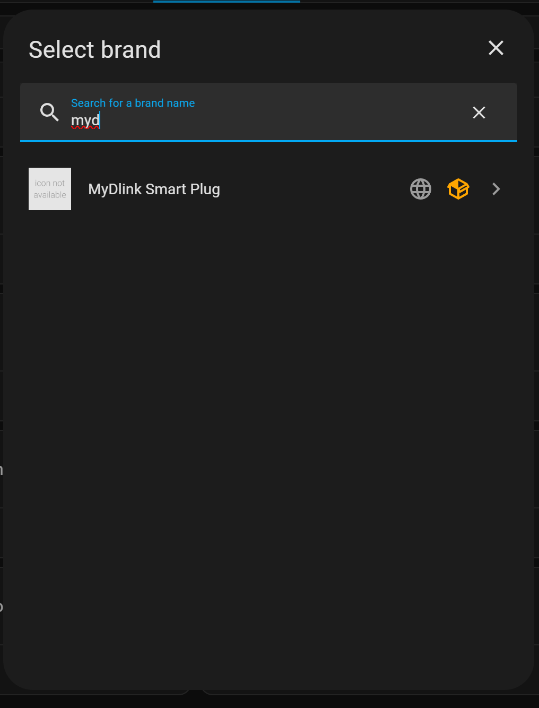
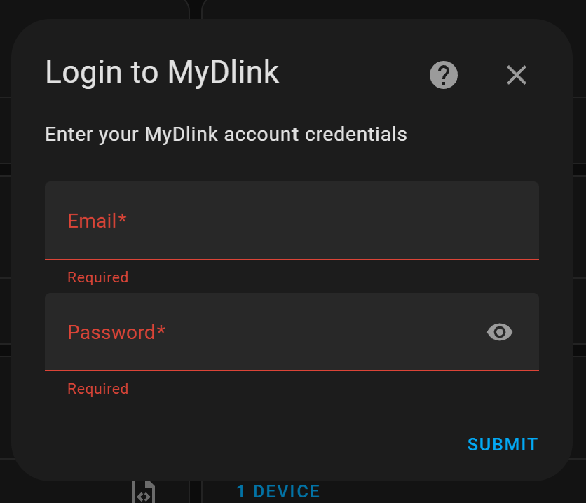

# Mydlink smart plug integration
Integrate your D-Link smart plugs to Home Assistant

## Instalation
1. Install the custom component ([see the previous guide](https://github.com/JTechCzech/mydlink-HA-integration)).
2. Goto Settings -> Device & services -> Add integration

3. Log-in with your mydlink login

4. Enjoy  
 
Loading GIF...  

