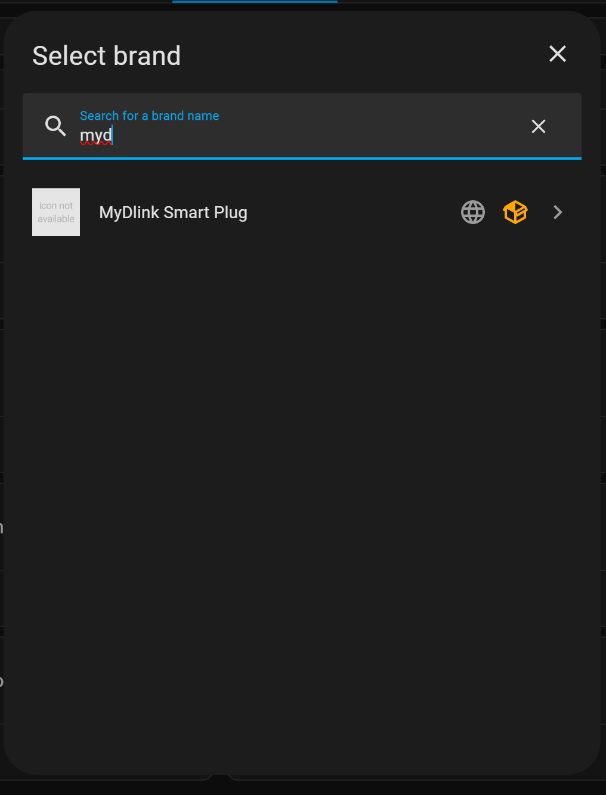
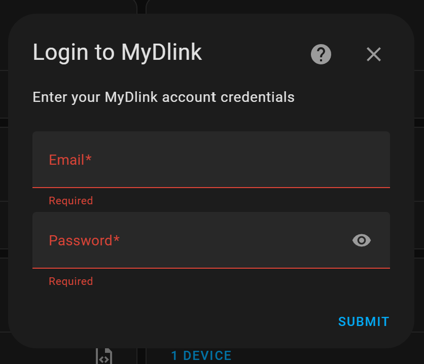

# Mydlink smart plug integration
Integrate your D-Link smart plugs to Home Assistant

## Instalation
1. Install the custom component ([see the previous guide](https://github.com/JTechCzech/mydlink-HA-integration)).
2. Goto Settings -> Device & services -> Add integration

3. Log-in with your mydlink login

4. Enjoy  
<br>
<span style="font-weight: bold;">Loading GIF...</span>  


## Quick fixes

### Devices not showing up

This behavior may be caused by a different server location from yours.\
Our application supports only the European server by default:

`https://mp-eu-openapi.auto.mydlink.com`

If this happens, try changing the server subdomain to your region in the
`const.py` file.

### Available regions

**Europe**

``` text
https://mp-eu-openapi.auto.mydlink.com
```

**America**

``` text
https://mp-us-openapi.auto.mydlink.com
```

**Taiwan**

``` text
https://mp-tw-openapi.auto.mydlink.com
```

Unfortunately, I don't know more regions right now.\
But it is not a problem to find out your region.

Just download a network traffic monitoring application like
**PCAPdroid** from [Google
Play](https://play.google.com/store/apps/details?id=com.emanuelef.remote_capture).

Follow these steps:

1.  Start traffic monitoring.
2.  Start the **mydlink** app.
3.  Go back to **PCAPdroid** and check the detected subdomain.
4.  Disable traffic monitoring.
5.  Change the subdomain in `const.py`.

If you find a new region, we would be very happy if you could help the
project community by editing the `README.md` file and creating a Pull
Request for approval. ❤️

